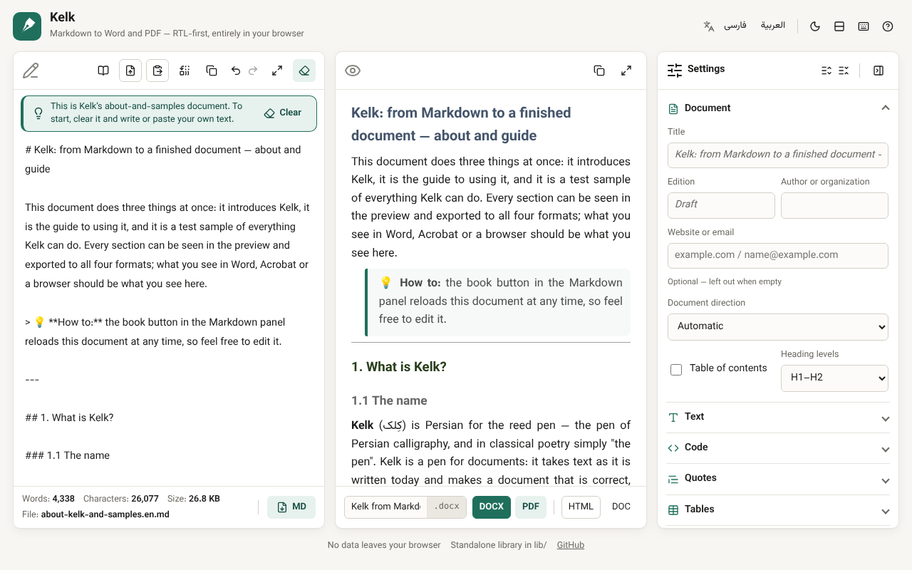
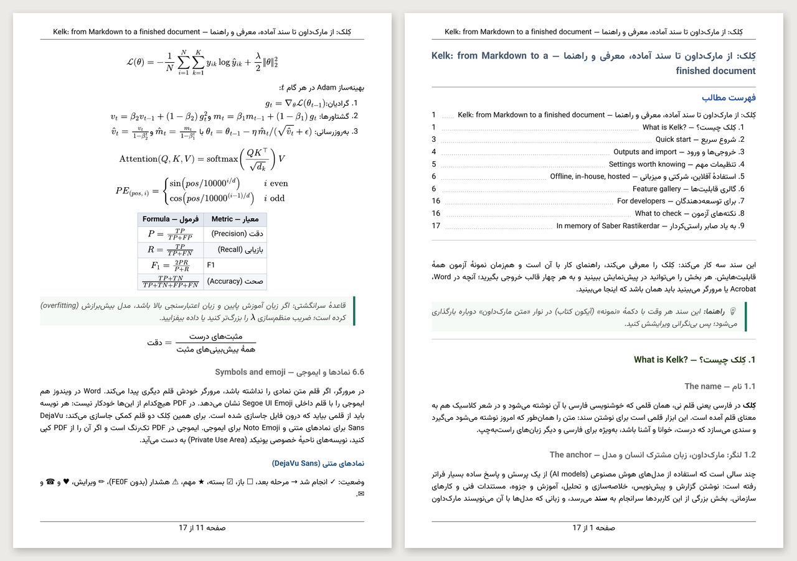
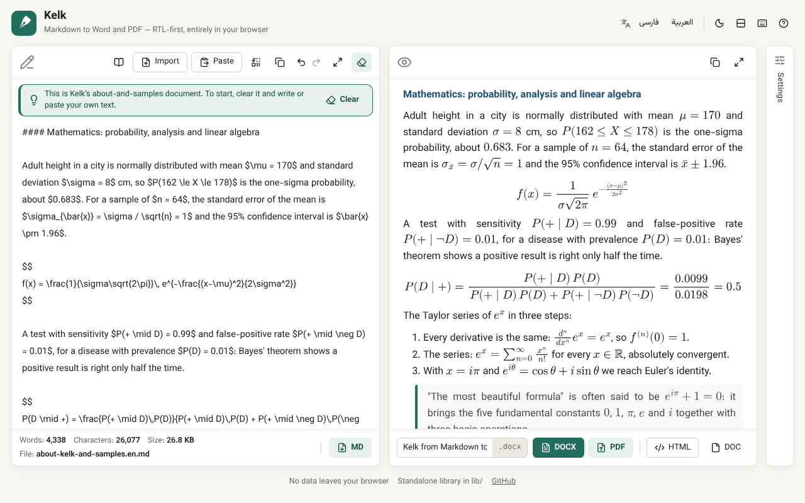
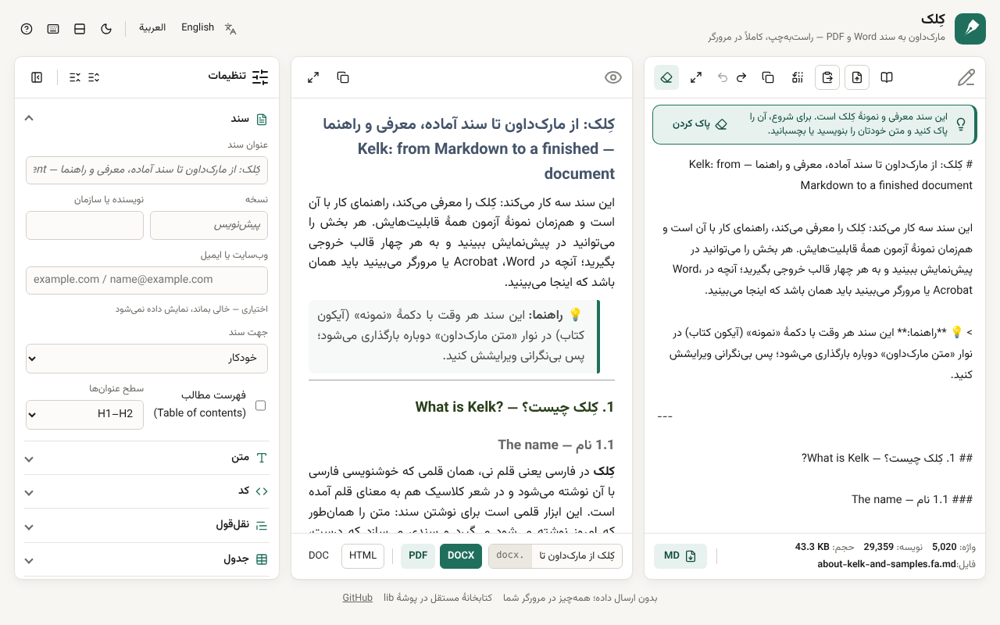
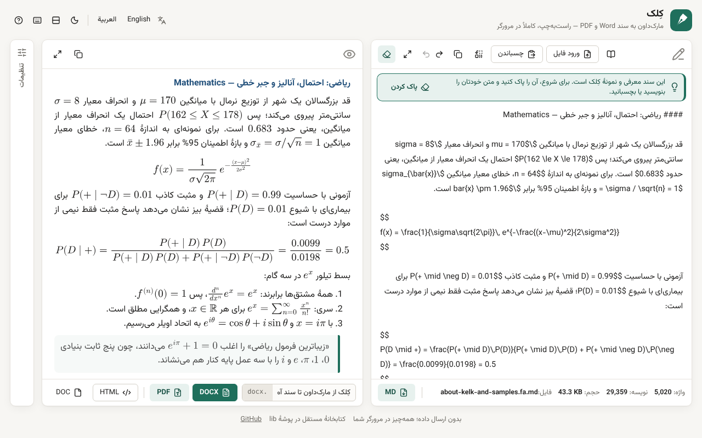
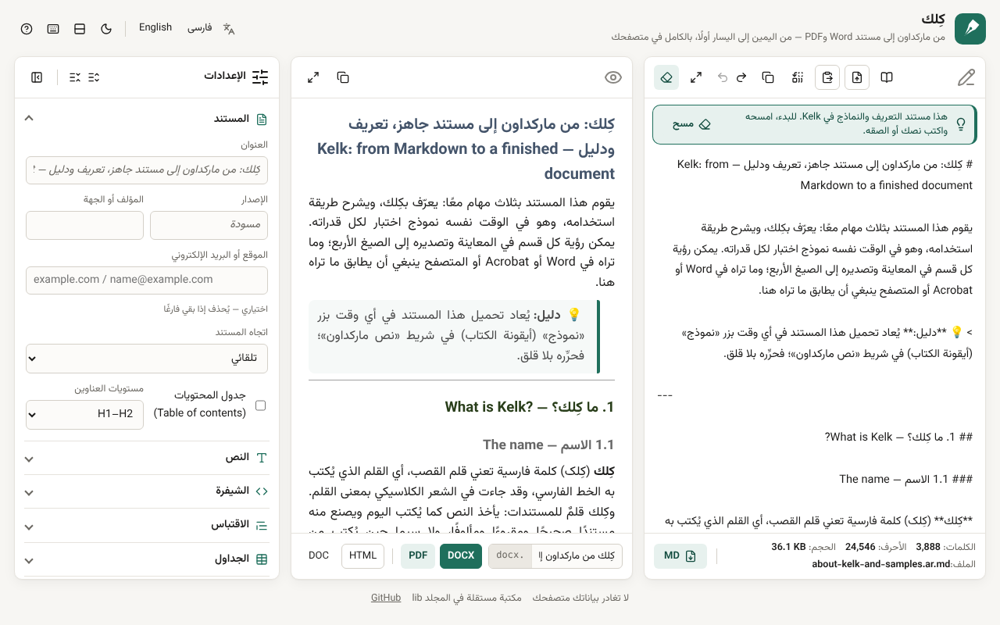
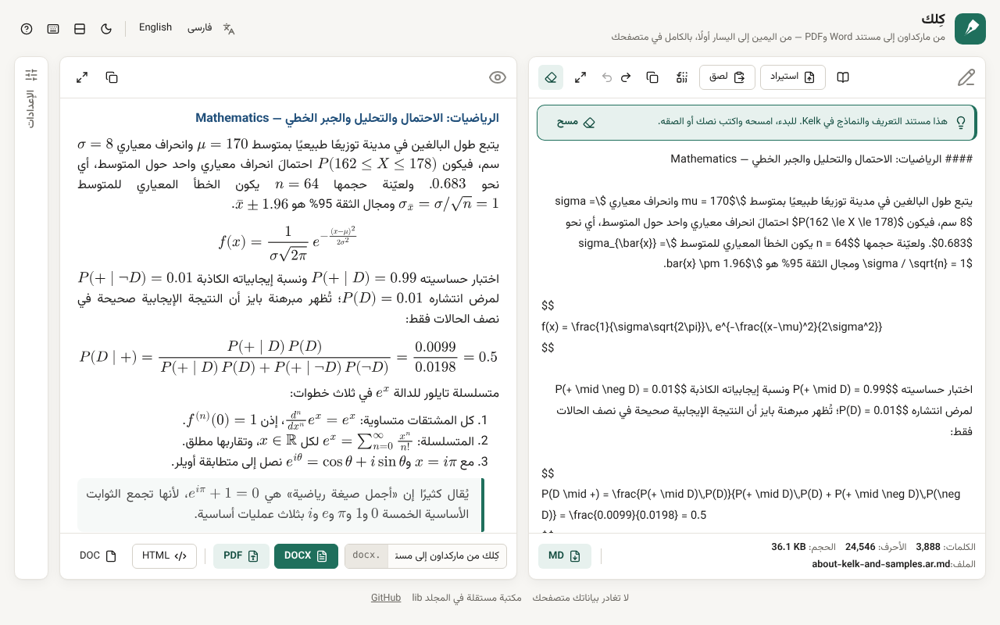

# Kelk — Markdown to Word (DOCX, DOC), PDF and HTML, in the browser

**Kelk** (کِلک) converts **Markdown** — full **GitHub Flavored Markdown (GFM)** — into
**Word DOCX**, **Word DOC (MHTML)**, **PDF** and a **standalone HTML** page, and converts
**Word .docx, HTML and rich text back to Markdown**. It runs **100% client-side in your browser**:
no server, no upload, no account, no installation — it even works **offline** from `file://`.

It gets **right-to-left and bidirectional text** right — **Persian (Farsi), Arabic, Hebrew, Urdu,
Kurdish** mixed with English — and works just as well for **every left-to-right language**
(English, French, German, Spanish, Greek, Russian …). Interface in **English, فارسی and العربية**.
Free and open source (MIT).

**▶ [Open Kelk online](https://mohsen-1984.github.io/kelk/)** ·
**⬇ [Download kelk_1.5.zip](https://github.com/mohsen-1984/kelk/releases/latest/download/kelk_1.5.zip)** ·
[فارسی ↓](#fa) · [العربية ↓](#ar) · Contact: [mhn.com@gmail.com](mailto:mhn.com@gmail.com)



## What it does

- **Markdown → DOCX** with real Word styles (Heading, Quote, List Paragraph, TOC) — ready to edit.
- **Markdown → PDF** with its own layout engine: Arabic-script shaping, diacritics (harakat),
  embedded fonts, page numbers, a **table of contents with page numbers and links**, bookmarks.
- **Markdown → DOC (MHTML)** for Microsoft Word with a completely free-form header and footer.
- **Markdown → HTML**: one standalone file with fonts, styles and images embedded.
- **DOCX / HTML / pasted rich text → Markdown** — clean input for AI models (fewer tokens, clear structure).
- **Full GFM** ([spec](https://github.github.com/gfm/)): tables with alignment, task lists,
  nested lists, strikethrough, fenced code with syntax highlighting, quotes, links, images.
- **Images**: drop or paste a picture into the text (embedded in every output), use a public web
  URL, or add a logo to the header.
- **Bidirectional text done right**: the direction of every paragraph, list item, quote and table
  cell; numbers, brackets, formulas and English words inside RTL text keep their order.
- **LaTeX formulas** (`$…$`, `$$…$$`, `\(…\)`, `\[…\]`) in the preview and all four outputs:
  editable **Word equations** in DOCX and DOC, vectors in PDF, SVG or MathML in HTML — and Word
  equations come back as LaTeX on import. Local MathJax, no network.
- **Table styles**: lines (none, under the header, horizontal, vertical, frame, grid) × fill (none,
  colored header, zebra stripes, both), three colors and a total row — the same in every output;
  code blocks and quotes have their own colors.
- Maximize the editor or the preview; *Clear & paste* turns the clipboard into the document.
- Header and footer (structured, simple or custom HTML), automatic title and edition, fonts chosen
  apart for PDF and Word, A3–A5/Letter/Legal pages, a monospace code font made for Persian and Arabic.

| Output | Best for | Fonts |
|---|---|---|
| **PDF** | sending, sharing, printing — the easiest | embedded |
| **DOCX** | editing in Word | must be installed on the reader's computer |
| **DOC** (MHTML) | a free-form header/footer; Microsoft Word only | must be installed |
| **HTML** | a standalone page for the web or an archive | embedded |





## Use it

- **Online:** [mohsen-1984.github.io/kelk](https://mohsen-1984.github.io/kelk/).
- **On your computer:** [download kelk_1.5.zip](https://github.com/mohsen-1984/kelk/releases/latest/download/kelk_1.5.zip),
  unpack it and open `index.html` — offline, for personal use or inside a company network.
- **On your own host:** upload the folder to any static web host.

The about-and-guide document opens on the first visit, in the interface language:
[English](docs/about-kelk-and-samples.en.md) · [فارسی](docs/about-kelk-and-samples.fa.md) ·
[العربية](docs/about-kelk-and-samples.ar.md).

## For developers

`lib/` is a **standalone JavaScript library** with no build step: four builders with one API —
`DocxBuilder` (.docx, on docx.js), `PdfBuilder` (.pdf, on jsPDF), `WordHtmlBuilder` (.doc),
`HtmlBuilder` (.html) — plus `PreviewBuilder` (a live preview in a page element, on
`HtmlBuilder`'s logic and stylesheet), `BidiCore` (every direction decision) and `MarkdownImporter`
(.docx/HTML → Markdown). Any font can be prepared for the PDF with `tools/build_pdf_fonts.py`.
Documentation: **[`lib/README.md`](lib/README.md)**.

```js
const pdf = await PdfBuilder.create()
    .registerFonts(window.PdfFonts)
    .configure({ fonts: { bidi: 'Vazirmatn', latin: 'Vazirmatn' }, toc: { levels: 2 } })
    .addFromHtml(marked.parse(markdown))
    .toBlob();
```

```text
index.html     the page            scripts/, styles/   the page's code (window.Kelk)
lib/           the library         assets/             icons and web fonts
vendor/        third-party libraries (pinned versions, sources listed in index.html)
docs/          about + guide + samples (en / fa / ar) and screenshots
tests/         index.html — every test case through the four builders, in the browser
tools/         bidi-lab.html (every direction rule) · build_pdf_fonts.py · build-icons.js · build-samples.js · og-image.html (source of assets/og-image.png)
```

## Contact, credits, license

Questions and suggestions: **[mhn.com@gmail.com](mailto:mhn.com@gmail.com)** (e-mail is the best
way; this repository is not watched every day).
Code: **MIT** ([`LICENSE`](LICENSE)); libraries and fonts keep their own licenses
([`THIRD-PARTY-NOTICES.md`](THIRD-PARTY-NOTICES.md)).
Vazirmatn, Vazir Code and Sahel are the work of the late
[Saber Rastikerdar](https://github.com/rastikerdar) — in his memory.

---

<a id="fa"></a>
<div dir="rtl">

## کِلک — تبدیل مارک‌داون به Word، PDF و HTML در مرورگر

**کِلک** متن **مارک‌داون** — با پشتیبانی کامل از **GitHub Flavored Markdown (GFM)** — را به
**Word DOCX**، **Word DOC (MHTML)**، **PDF** و یک صفحهٔ **HTML مستقل** تبدیل می‌کند، و فایل
**Word (.docx)، HTML و متن کپی‌شده از Word یا وب را به مارک‌داون** برمی‌گرداند. همه‌چیز
**کاملاً در مرورگر شما (client-side)** انجام می‌شود: بدون سرور، بدون بارگذاری فایل، بدون حساب کاربری
و بدون نصب؛ حتی **بدون اینترنت** و مستقیم از `file://` کار می‌کند.

متن **راست‌به‌چپ و دوجهتی (BiDi)** — **فارسی، عربی، عبری، اردو، کردی** در کنار انگلیسی — را درست
می‌چیند و برای **همهٔ زبان‌های چپ‌به‌راست** هم به همان خوبی کار می‌کند. رابط کاربری به فارسی،
English و العربية است. رایگان و متن‌باز (MIT).

**▶ [کِلک برخط](https://mohsen-1984.github.io/kelk/)** ·
**⬇ [دریافت kelk_1.5.zip](https://github.com/mohsen-1984/kelk/releases/latest/download/kelk_1.5.zip)** ·
تماس: [mhn.com@gmail.com](mailto:mhn.com@gmail.com)



### قابلیت‌ها

- **مارک‌داون به DOCX** با سبک‌های واقعی Word؛ آمادهٔ ویرایش.
- **مارک‌داون به PDF** با موتور چیدمان خود کِلک: شکل‌دهی حروف، حرکت‌گذاری، قلم‌های درون فایل، شمارهٔ صفحه و **فهرست مطالب با شمارهٔ صفحه و پیوند**.
- **مارک‌داون به DOC (MHTML)** برای Microsoft Word، با سربرگ و پانویس کاملاً آزاد.
- **مارک‌داون به HTML**: یک فایل مستقل با قلم‌ها، سبک‌ها و تصویرهای درون فایل.
- **DOCX، HTML و متن کپی‌شده به مارک‌داون**: ورودی تمیز برای مدل‌های هوش مصنوعی؛ توکن کمتر و ساختار روشن‌تر.
- **پشتیبانی کامل از GFM** ([مشخصات](https://github.github.com/gfm/)): جدول با ترازبندی، فهرست کارها، فهرست تودرتو، خط‌خوردگی، بلوک کد با رنگ‌آمیزی، نقل‌قول، پیوند و تصویر.
- **تصویر:** کشیدن یا چسباندن تصویر در متن (در همهٔ خروجی‌ها جاسازی می‌شود)، نشانی عمومی وب، یا لوگو در سربرگ.
- **دوجهتی درست:** جهت هر پاراگراف، آیتم فهرست، نقل‌قول و سلول جدول؛ عددها، پرانتزها، فرمول‌ها و واژه‌های انگلیسی ترتیبشان را حفظ می‌کنند.
- **فرمول‌های LaTeX** (`$…$` و `$$…$$`) در پیش‌نمایش و هر چهار خروجی: **معادلهٔ قابل ویرایش Word** در DOCX و DOC، برداری (vector) در PDF، و SVG یا MathML در HTML؛ معادله‌های Word هنگام ورود به LaTeX برمی‌گردند. MathJax محلی، بدون اینترنت.
- **سبک جدول (Table style):** خطوط (بدون خط، زیر عنوان، افقی، عمودی، قاب، شبکه‌ای) × پس‌زمینه (بدون رنگ، عنوان رنگی، راه‌راه یا هر دو)، سه رنگ و سطر جمع؛ در همهٔ خروجی‌ها یکسان. بلوک کد و نقل‌قول هم رنگ‌های خودشان را دارند.
- بزرگ‌کردن ویرایشگر یا پیش‌نمایش؛ «پاک کردن و چسباندن» (Clear & paste) محتوای کلیپ‌بورد را سند می‌کند.



### استفاده

- **برخط:** [mohsen-1984.github.io/kelk](https://mohsen-1984.github.io/kelk/)
- **روی رایانه:** [kelk_1.5.zip](https://github.com/mohsen-1984/kelk/releases/latest/download/kelk_1.5.zip) را دریافت کنید، باز کنید و `index.html` را باز کنید؛ بدون اینترنت، برای استفادهٔ شخصی یا در شبکهٔ داخلی شرکت.
- **روی میزبان خودتان:** پوشه را روی هر میزبان وب ایستا بارگذاری کنید.

### تماس، قدردانی و مجوز

پرسش و پیشنهاد: **[mhn.com@gmail.com](mailto:mhn.com@gmail.com)** (بهترین راه ارتباط ایمیل است).
کد با **مجوز MIT** منتشر شده؛ کتابخانه‌ها و قلم‌ها مجوز خودشان را دارند (`THIRD-PARTY-NOTICES.md`).
Vazirmatn، Vazir Code و Sahel کار زنده‌یاد [صابر راستی‌کردار](https://github.com/rastikerdar) است؛ یادش گرامی.

</div>

---

<a id="ar"></a>
<div dir="rtl">

## كِلك — تحويل ماركداون إلى Word وPDF وHTML في المتصفح

يحوّل **كِلك** نص **ماركداون** — مع دعم كامل لـ **GitHub Flavored Markdown (GFM)** — إلى
**Word DOCX** و**Word DOC (MHTML)** و**PDF** وصفحة **HTML مستقلة**، ويعيد **ملفات Word (.docx)
وHTML والنص المنسوخ من Word أو الويب إلى ماركداون**. يعمل كل شيء **بالكامل في متصفحك
(client-side)**: بلا خادم، ولا رفع ملفات، ولا حساب، ولا تثبيت؛ ويعمل حتى **دون إنترنت** من `file://`.

يعالج **النصوص من اليمين إلى اليسار وثنائية الاتجاه (BiDi)** — **العربية والفارسية والعبرية
والأردية والكردية** مع الإنجليزية — ويعمل بالجودة نفسها **لكل لغات الكتابة من اليسار إلى اليمين**.
الواجهة بالعربية والفارسية والإنجليزية. مجاني ومفتوح المصدر (MIT).

**▶ [كِلك على الإنترنت](https://mohsen-1984.github.io/kelk/)** ·
**⬇ [تنزيل kelk_1.5.zip](https://github.com/mohsen-1984/kelk/releases/latest/download/kelk_1.5.zip)** ·
للتواصل: [mhn.com@gmail.com](mailto:mhn.com@gmail.com)



### القدرات

- **ماركداون إلى DOCX** بأنماط Word حقيقية، جاهز للتحرير.
- **ماركداون إلى PDF** بمحرّك تخطيط خاص: تشكيل الحروف العربية، والحركات، والخطوط المضمَّنة، وأرقام الصفحات، و**جدول محتويات بأرقام الصفحات والروابط**.
- **ماركداون إلى DOC (MHTML)** لبرنامج Microsoft Word، برأس وتذييل حرّين تمامًا.
- **ماركداون إلى HTML**: ملف واحد مستقل بخطوطه وأنماطه وصوره.
- **DOCX وHTML والنص الملصوق إلى ماركداون**: مدخلات نظيفة لنماذج الذكاء الاصطناعي؛ رموز أقل وبنية أوضح.
- **دعم كامل لـ GFM** ([المواصفات](https://github.github.com/gfm/)): جداول بمحاذاة، وقوائم مهام، وقوائم متداخلة، وشطب، وكتل شيفرة ملوّنة، واقتباسات، وروابط، وصور.
- **الصور:** سحب الصورة أو لصقها في النص (تُضمَّن في كل الصيغ)، أو عنوان ويب عام، أو شعار في الرأس.
- **ثنائية اتجاه صحيحة:** اتجاه كل فقرة وعنصر قائمة واقتباس وخلية جدول؛ وتحافظ الأرقام والأقواس والمعادلات والكلمات الإنجليزية على ترتيبها.
- **صيغ LaTeX** (`$…$` و`$$…$$`) في المعاينة والمخرجات الأربعة: **معادلات Word قابلة للتحرير** في DOCX وDOC، ومتجهات (vector) في PDF، وSVG أو MathML في HTML؛ وتعود معادلات Word إلى LaTeX عند الاستيراد. MathJax محلي، بلا إنترنت.
- **نمط الجدول (Table style):** الخطوط (بلا خطوط، تحت الرأس، أفقية، عمودية، إطار، شبكي) × التعبئة (بلا تعبئة، رأس ملوَّن، تخطيط أو كلاهما)، وثلاثة ألوان، وصف مجموع؛ واحد في كل المخرجات. ولكتل الشيفرة والاقتباسات ألوانها أيضًا.
- تكبير المحرّر أو المعاينة؛ و«مسح ولصق» يجعل محتوى الحافظة هو المستند.


- **الخطوط:** Vazirmatn، الخط الافتراضي، يدعم العربية؛ ويمكن تجهيز خطوط عربية مثل Cairo وAmiri وNoto Naskh Arabic لملفات PDF.

### الاستخدام

- **على الإنترنت:** [mohsen-1984.github.io/kelk](https://mohsen-1984.github.io/kelk/)
- **على حاسوبك:** نزّل [kelk_1.5.zip](https://github.com/mohsen-1984/kelk/releases/latest/download/kelk_1.5.zip) وافتحه ثم افتح `index.html`؛ يعمل دون إنترنت، للاستخدام الشخصي أو داخل شبكة المؤسسة.
- **على استضافتك:** ارفع المجلد إلى أي استضافة ويب ثابتة.

### التواصل والشكر والترخيص

للأسئلة والاقتراحات: **[mhn.com@gmail.com](mailto:mhn.com@gmail.com)** (البريد الإلكتروني أفضل وسيلة للتواصل).
الشيفرة بترخيص **MIT**؛ وللمكتبات والخطوط تراخيصها الخاصة (`THIRD-PARTY-NOTICES.md`).
Vazirmatn وVazir Code وSahel من عمل الراحل [صابر راستي كردار](https://github.com/rastikerdar)، رحمه الله.

</div>
